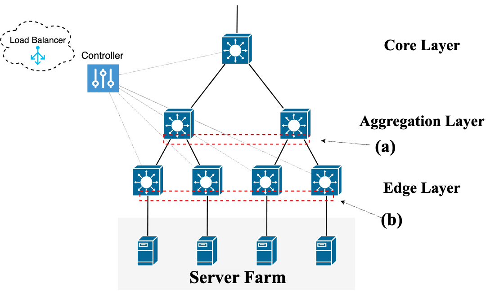

# SDN Misreporting Attacks Setup

## Overview
The code base for the misreporting attack experiments is composed of three main components: the Floodlight SDN controller that orchestrates the SDN and runs the load balancer application, the Mininet SDN emulator for setting up a virtual network, and the Open vSwitch (ovs) switch operating system that runs an OpenFlow agent to communicate with the SDN controller.

The core scripts for setting up the vitual network and running the experiments are located in this directory (```<repo_root>/sdnlb-scripts```). The network is setup via the ```pytestnet.py``` script that uses the Mininet python library to create a virtual network and enters the Mininet CLI for interacting with the hosts, switches, and devices. All of the configuration to launch the attack is handled here. As discussed in our paper <ins>(TODO: add link)</ins>, the virtual network topology is formed by creating links between a remote client, an internal switch (e.g., aggregation- or core-layer switch), and multiple edge switches (who's load is used as a proxy for backend server load):



Once the virtual network is created, the experiments can be launched from the Mininet CLI by invoking the traffic generator scripts (located in ```flooderc/```) to initiate traffic from the remote host toward the virtual IP address exposed by the load balancing pool. The controller will in turn periodically collect traffic loads from the edge switches, and translate between the virtual IP address of the load balancing pool and the physical IP addresses of the chosen backend servers. 

To get all of the components set up to run the experiments requires three tasks: setting up the Floodlight controller, setting up the Open vSwitch switches, and setting up the Mininet virtual network:

## Getting Floodlight SDN controller setup
To get the controller running, we first must do a clean build of the source code (note that the experiments were built upon a Floodlight source code snapshot at commit ID: 18ef8882180d2f002c3c57c17d270ade885ef479). At this stage, we ensure that the correct settings are enabled for the load balancer (e.g., load report collect interval). Note that the default parameters are already enabled in this repository. Afterwards, we clean any build artifacts and create a new build:
- To clean build artifacts: `ant clean`
- To build the new controller: `ant`

Once we have the controller built, we can start the Floodlight controller to begin listening for switch connections on the control plane:
- To start the controller: `sudo java -jar target/floodlight.jar`
  
## Getting Open vSwitch setup
The latest Open vSwitch (ovs) code can be downloaded at: https://docs.openvswitch.org/en/latest/intro/install/index.html. On Linux-based systems, the process requires the user to first configure the build process by running the built-in configuration scripts. Next, the switch software can be built (using version 2.12.0) and installed to the system for the Mininet emulator to use. The ovs code base comes with a suite of built-in utilities (via e.g., `ovs-ctl` subcommands) for managing switch functionality and flow tables (either before starting the switch or dynamically while they are running), which we leverage for configuring the switches properly for load balancing.

## Getting Mininet Setup
The code base for Mininet can be downloaded at: http://mininet.org/download/. The easiest method to configure the system is to build and install the software from source (version 2.2.2), alongside Open vSwitch and Floodlight controller (however, a VM image of Mininet is also available for download). After configurng the build process and compiling the code, Mininet can be used either as a linkable library (e.g., a python library) or interactively with the Mininet CLI.


## Running the experiments
To begin running experiments, we must first start the mininet virtual network:
- To clean any currently running Mininet networks on the system: `sudo mn -c`
- To start our Mininet network with the custom topology: `sudo python pytestnet.py 10 10.0.0.100`

Once the script executes, the new switches are configured, running, and connected to the Floodlight controller that is running on the system (note that at this point one switch is designated to be malicious). At this point, the script invokes the interactive Mininet CLI (shown by a `mininet>` prompt) to manage and initiate events within the virtual network. To ensure connectivity in the network, we first check that switches can reach each other and the controller:
- To test connectivity: `pingall`

Then we must signify to the load balancer that the switches are running and should be recognized as a load balancing pool (from which a virtual IP address is exposed to remote clients):
- From another terminal (not the Mininet CLI), to set up the load balancing pool: `./pylb.sh`

At this point the network is fully configured and we can begin running different traffic generators to collect load balancing measurements. We created a traffic generator (called *flooder*) in `flooderc/flooder.c` that generates requests toward the virtual IP address of the load balancing pool (`10.0.0.100`) according to a pareto distribution of flow sizes and durations (as discussed in the paper). The flooder should be compiled using the `Makefile` and can then be invoked:
- To invoke the traffic generator from within the Mininet CLI and with the uplink/remote client host as the source: `uph cd flooderc; make clean; make; ./main`

From here, the flooder can run to completion (a configurable number of seconds or flows) or be stopped at any point. Simulatanesouly, the load balancer is observing the requests and dynamically balancing load across the edge switches, while logging all of the results to both `stdout` and to `pylb-output/` for further processing. The controller output can also be redirected to a file for displaying progress of the load balancing and other debug information related to the misreporting attack.

We have also included a python script `parse_exp.py` for parsing the results and generating several plots that display information about the load balancing and the effectiveness of the misreporting attack, including load distribution across pool members over time, misreporting success rate, etc.


